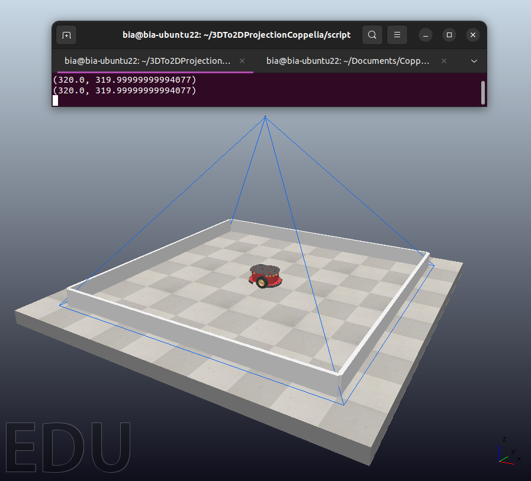
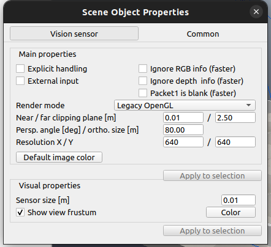

<h1 align="center">
Using CoppeliaSim for the calculation of 3D to 2D projection
</h1>

<div align="center">
<h3>
<a href="https://www.linkedin.com/in/beatriz-emiliano/">Beatriz Emiliano Maciel de Sousa</a>
</h3>
</div>

# Guide
- [Description](#description)
- [Features](#features)
- [Technologies used](#technologies-used)
- [Installations](#installations)
- [Application](#application)

# Description
This repository provides an implementation in CoppeliaSim for the calculation of 3D to 2D projection using the focal length method. The goal is to transform three-dimensional points into two-dimensional pixel coordinates, simulating the projection process in a virtual camera. The method takes into account the camera's focal length to compute pixel coordinates corresponding to 3D points, crucial in various applications such as computer vision and virtual environment simulations.
<div align="center">



</div>

# Features
- Conversion of 3D points to 2D pixel coordinates with python.
- Simulation of projection using the focal length method.

# Technologies used:
- Python 3.x
- CoppeliaSim
- NumPy

# Installations:
- CoppeliaSim 
```
Use the instructions on the website, I used the EDU version
```
<div align="center">

[ site ](https://www.coppeliarobotics.com/downloads)

</div>

- ZeroMQ 
ZeroMQ is a messaging library that provides asynchronous communication capabilities between processes. To install the ZeroMQ remote API for CoppeliaSim:
```
$ python3 -m pip install coppeliasim - zmqremoteapi - client
```

# Application

- Open the CoppeliaSim software:
```
$ cd ~/CoppeliaSimPath
$ ./coppeliaSim.sh
```
- Load the scene: 
```
File > Open scene... >> projetcion.ttt
```
- Check the specifications of your vision sensor and adjust in the code, by default, the scene values are these:

<div align="center">



</div>

- Run the code
```
$ cd ~/3Dto2DProjectionCoppelia/script
$ python3 projection.py
```
